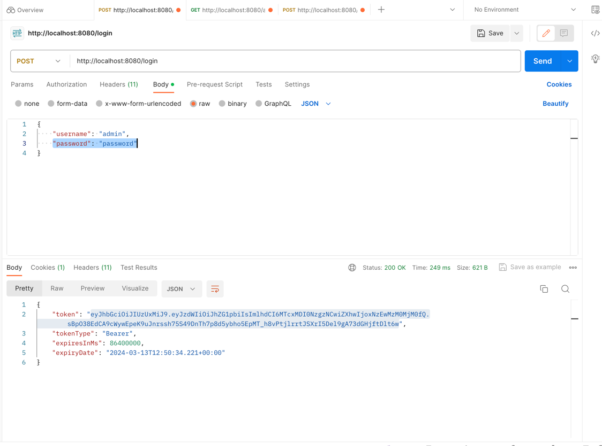
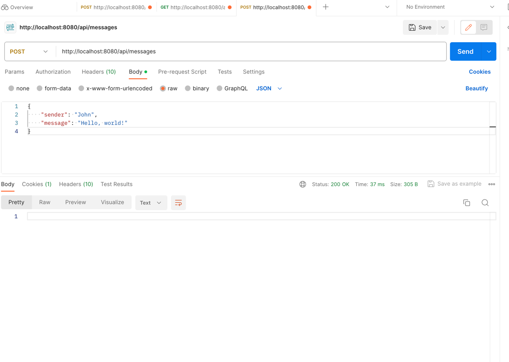
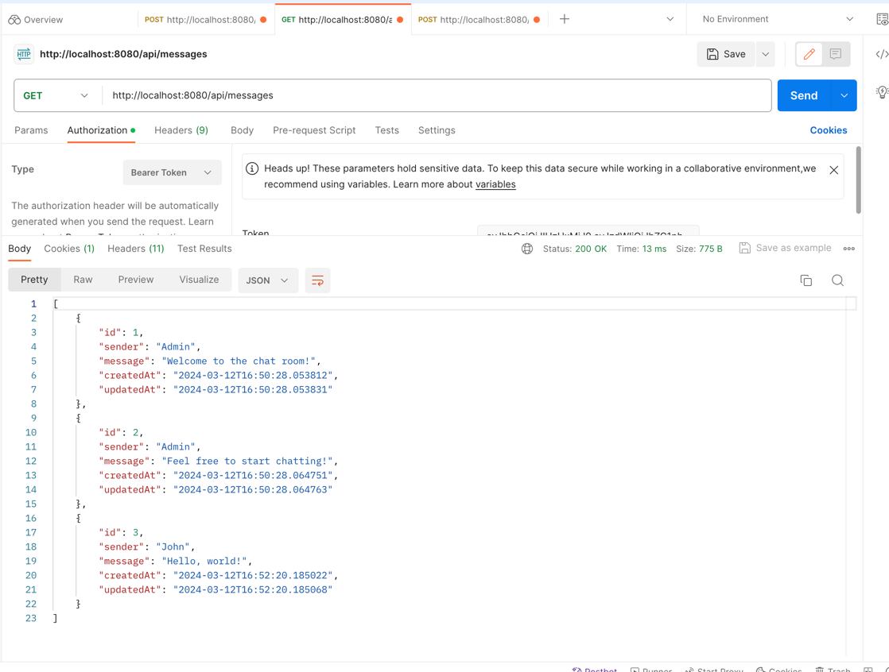

# Chat Message Application

This is a simple chat message application implemented using Java Spring Boot.

## Overview

The application provides a RESTful API for sending and retrieving chat messages. Users can send messages with their name as the sender and the content of the message.

## Features

- Send a chat message: Users can send a chat message with their name and the content of the message.
- Retrieve chat messages: Users can retrieve all chat messages sent in the application.

## Technologies Used

- Java Spring Boot: Used for building the backend RESTful API.
- Maven: Dependency management and build tool.
- H2 Database: In-memory database for storing chat messages.
- Postman: Testing the RESTful API endpoints.

## Setup

1. Clone the repository:

    ```bash
    git clone https://github.com/yasirshabbir44/chat-app.git
    ```

2. Navigate to the project directory:

    ```bash
    cd chat-message-app
    ```

3. Build the project using Maven:

    ```bash
    mvn clean install
    ```

4. Run the application:

    ```bash
    java -jar target/chat-message-app.jar
    ```

5. The application will start on http://localhost:8080 by default.

## API Endpoints

- **POST /api/login**: Login User.
- **POST /api/messages**: Send a chat message.
- **GET /api/messages**: Retrieve all chat messages.

## Usage

1. Login:

    ```http
    POST /api/login
    Content-Type: application/json

    {
        "username": "admin",
        "password": "password"
    }
    ```



2. Send a chat message:

    ```http
    POST /messages
    Content-Type: application/json

    {
        "sender": "John",
        "message": "Hello, world!"
    }
    ```



3. Retrieve all chat messages:

    ```http
    GET /messages
    ```


## Contributing

Contributions are welcome! If you have any suggestions, feature requests, or bug reports, please open an issue or create a pull request.

## License

This project is licensed under the MIT License - see the [LICENSE](LICENSE) file for details.
